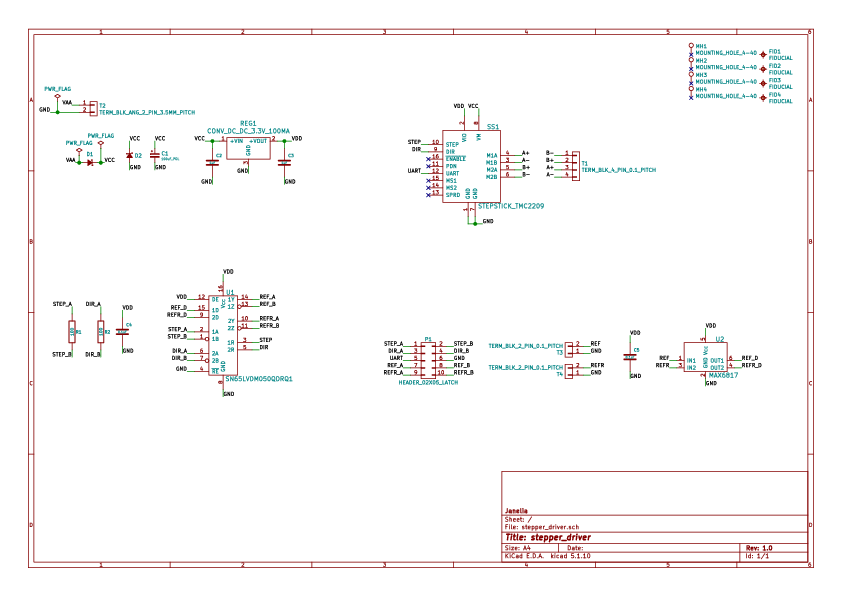
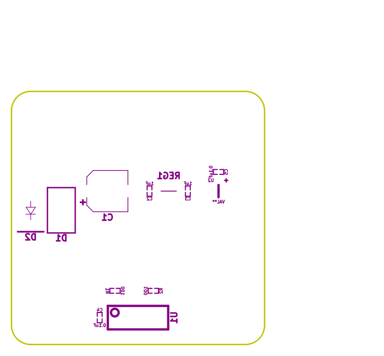
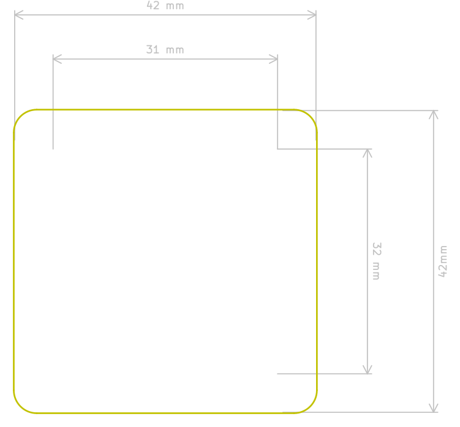
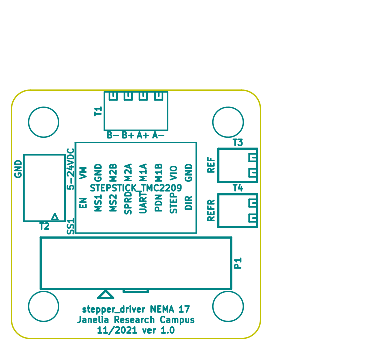

# Table of Contents

1.  [Repository Information](#org0b3d6bb)
    1.  [Description](#org2920793)
2.  [Images](#org5d22837)
3.  [Schematic](#org90231e0)
4.  [Gerbers](#orgd7d1468)
5.  [Bill of Materials](#org1d5878e)
    1.  [PCB Parts](#org3b9f628)
    2.  [Supplemental Parts](#orgfc963ba)
    3.  [Vendor Parts Lists](#orgfa7a4ec)
6.  [Supplemental Documentation](#org55c6723)
    1.  [Assembly Instructions](#org3f4d667)
7.  [Manufacturing Archive](#org50f5666)

# Repository Information

-   **Name:** stepper\_driver
-   **Version:** 1.0
-   **License:** Open-Source Hardware
-   **URL:** <https://github.com/janelia-kicad/stepper_driver>
-   **Author:** Peter Polidoro
-   **Email:** peter@polidoro.io

## Description

This board takes power and step, direction, and UART commands to drive stepper
motors from another stepper controller board.

# Images

# Schematic

[./schematic/stepper\_driver.pdf](./schematic/stepper_driver.pdf)

# Gerbers

# Bill of Materials

## PCB Parts

<table border="2" cellspacing="0" cellpadding="6" rules="groups" frame="hsides">

<colgroup>
<col  class="org-right" />

<col  class="org-left" />

<col  class="org-right" />

<col  class="org-left" />

<col  class="org-left" />

<col  class="org-left" />

<col  class="org-left" />

<col  class="org-left" />

<col  class="org-left" />
</colgroup>
<thead>
<tr>
<th scope="col" class="org-right">Item</th>
<th scope="col" class="org-left">Reference(s)</th>
<th scope="col" class="org-right">Quantity</th>
<th scope="col" class="org-left">Manufacturer</th>
<th scope="col" class="org-left">Manufacturer Part Number</th>
<th scope="col" class="org-left">Vendor</th>
<th scope="col" class="org-left">Vendor Part Number</th>
<th scope="col" class="org-left">Description</th>
<th scope="col" class="org-left">Package</th>
</tr>
</thead>

<tbody>
<tr>
<td class="org-right">1</td>
<td class="org-left">C1</td>
<td class="org-right">1</td>
<td class="org-left">Würth Elektronik</td>
<td class="org-left">865080545012</td>
<td class="org-left">Digi-Key</td>
<td class="org-left">732-8511-1-ND</td>
<td class="org-left">CAP ALUM 100UF 20% 35V</td>
<td class="org-left">&#xa0;</td>
</tr>

<tr>
<td class="org-right">2</td>
<td class="org-left">C2 C3</td>
<td class="org-right">2</td>
<td class="org-left">Samsung Electro-Mechanics</td>
<td class="org-left">CL05A105KL5NRNC</td>
<td class="org-left">Digi-Key</td>
<td class="org-left">1276-6796-1-ND</td>
<td class="org-left">CAP CER 1UF 35V X5R</td>
<td class="org-left">0402</td>
</tr>

<tr>
<td class="org-right">3</td>
<td class="org-left">C4 C5</td>
<td class="org-right">2</td>
<td class="org-left">Yageo</td>
<td class="org-left">CC0402ZRY5V8BB104</td>
<td class="org-left">Digi-Key</td>
<td class="org-left">311-1375-1-ND</td>
<td class="org-left">CAP CER 0.1UF 25V Y5V</td>
<td class="org-left">0402</td>
</tr>

<tr>
<td class="org-right">4</td>
<td class="org-left">D1</td>
<td class="org-right">1</td>
<td class="org-left">Nexperia USA Inc.</td>
<td class="org-left">PMEG45U10EPDAZ</td>
<td class="org-left">Digi-Key</td>
<td class="org-left">1727-7645-1-ND</td>
<td class="org-left">DIODE SCHOTTKY 45V 10A</td>
<td class="org-left">CFP15</td>
</tr>

<tr>
<td class="org-right">5</td>
<td class="org-left">D2</td>
<td class="org-right">1</td>
<td class="org-left">Littelfuse Inc.</td>
<td class="org-left">SZ1SMB28AT3G</td>
<td class="org-left">Digi-Key</td>
<td class="org-left">F11558CT-ND</td>
<td class="org-left">TVS DIODE 28VWM 45.4VC</td>
<td class="org-left">SMB</td>
</tr>

<tr>
<td class="org-right">6</td>
<td class="org-left">P1</td>
<td class="org-right">1</td>
<td class="org-left">3M</td>
<td class="org-left">N3793-6302RB</td>
<td class="org-left">Digi-Key</td>
<td class="org-left">MHS10N-ND</td>
<td class="org-left">CONN HEADER VERT 10POS 2.54MM</td>
<td class="org-left">&#xa0;</td>
</tr>

<tr>
<td class="org-right">7</td>
<td class="org-left">R1 R2</td>
<td class="org-right">2</td>
<td class="org-left">Stackpole Electronics Inc</td>
<td class="org-left">RMCF0402FT100R</td>
<td class="org-left">Digi-Key</td>
<td class="org-left">RMCF0402FT100RCT-ND</td>
<td class="org-left">RES 100 OHM 1% 1/16W</td>
<td class="org-left">0402</td>
</tr>

<tr>
<td class="org-right">8</td>
<td class="org-left">REG1</td>
<td class="org-right">1</td>
<td class="org-left">Richtek USA Inc.</td>
<td class="org-left">RT9058-33GV</td>
<td class="org-left">Digi-Key</td>
<td class="org-left">1028-1253-1-ND</td>
<td class="org-left">&#xa0;</td>
<td class="org-left">SOT-23-3</td>
</tr>

<tr>
<td class="org-right">9</td>
<td class="org-left">SS1</td>
<td class="org-right">16</td>
<td class="org-left">Mill-Max Manufacturing Corp.</td>
<td class="org-left">0305-0-15-15-47-27-10-0</td>
<td class="org-left">Digi-Key</td>
<td class="org-left">ED90331-ND</td>
<td class="org-left">CONN PIN RCPT .025-.037 SOLDER</td>
<td class="org-left">&#xa0;</td>
</tr>

<tr>
<td class="org-right">10</td>
<td class="org-left">T1</td>
<td class="org-right">1</td>
<td class="org-left">TE Connectivity AMP Connectors</td>
<td class="org-left">282834-4</td>
<td class="org-left">Digi-Key</td>
<td class="org-left">A98335-ND</td>
<td class="org-left">TERM BLOCK 4POS SIDE ENT 2.54MM</td>
<td class="org-left">&#xa0;</td>
</tr>

<tr>
<td class="org-right">11</td>
<td class="org-left">T2</td>
<td class="org-right">1</td>
<td class="org-left">Phoenix Contact</td>
<td class="org-left">1988956</td>
<td class="org-left">Digi-Key</td>
<td class="org-left">277-1779-ND</td>
<td class="org-left">&#xa0;</td>
<td class="org-left">&#xa0;</td>
</tr>

<tr>
<td class="org-right">12</td>
<td class="org-left">T3 T4</td>
<td class="org-right">2</td>
<td class="org-left">TE Connectivity AMP Connectors</td>
<td class="org-left">282834-2</td>
<td class="org-left">Digi-Key</td>
<td class="org-left">A98333-ND</td>
<td class="org-left">TERM BLOCK 2POS SIDE ENT 2.54MM</td>
<td class="org-left">&#xa0;</td>
</tr>

<tr>
<td class="org-right">13</td>
<td class="org-left">U1</td>
<td class="org-right">1</td>
<td class="org-left">Texas Instruments</td>
<td class="org-left">SN65LVDM050QDRQ1</td>
<td class="org-left">Digi-Key</td>
<td class="org-left">296-15386-1-ND</td>
<td class="org-left">IC TRANSCEIVER FULL 2/2</td>
<td class="org-left">16-SOIC</td>
</tr>

<tr>
<td class="org-right">14</td>
<td class="org-left">U2</td>
<td class="org-right">1</td>
<td class="org-left">Maxim Integrated</td>
<td class="org-left">MAX6817EUT+T</td>
<td class="org-left">Mouser</td>
<td class="org-left">MAX6817EUT+T</td>
<td class="org-left">IC DEBOUNCER SWITCH DUAL</td>
<td class="org-left">SOT-23-6</td>
</tr>

<tr>
<td class="org-right">&#xa0;</td>
<td class="org-left">FID1 FID2 FID3 FID4 MH1 MH2 MH3 MH4</td>
<td class="org-right">8</td>
<td class="org-left">&#xa0;</td>
<td class="org-left">&#xa0;</td>
<td class="org-left">&#xa0;</td>
<td class="org-left">&#xa0;</td>
<td class="org-left">&#xa0;</td>
<td class="org-left">&#xa0;</td>
</tr>
</tbody>
</table>

## Supplemental Parts

<table border="2" cellspacing="0" cellpadding="6" rules="groups" frame="hsides">

<colgroup>
<col  class="org-right" />

<col  class="org-right" />

<col  class="org-left" />

<col  class="org-left" />

<col  class="org-left" />

<col  class="org-left" />

<col  class="org-left" />
</colgroup>
<thead>
<tr>
<th scope="col" class="org-right">Item</th>
<th scope="col" class="org-right">Quantity</th>
<th scope="col" class="org-left">Manufacturer</th>
<th scope="col" class="org-left">Manufacturer Part Number</th>
<th scope="col" class="org-left">Vendor</th>
<th scope="col" class="org-left">Vendor Part Number</th>
<th scope="col" class="org-left">Description</th>
</tr>
</thead>

<tbody>
<tr>
<td class="org-right">1</td>
<td class="org-right">1</td>
<td class="org-left">Trinamic Motion Control GmbH</td>
<td class="org-left">TMC2209SILENTSTEPSTICK</td>
<td class="org-left">Digi-Key</td>
<td class="org-left">1460-TMC2209SILENTSTEPSTICK-ND</td>
<td class="org-left">TMC2209 STEPPER DRIVER BOARD</td>
</tr>

<tr>
<td class="org-right">2</td>
<td class="org-right">2</td>
<td class="org-left">Amphenol ICC (FCI)</td>
<td class="org-left">78511-108HLF</td>
<td class="org-left">Digi-Key</td>
<td class="org-left">609-78511-108HLF-ND</td>
<td class="org-left">CONN HEADER VERT 8POS 2.54MM</td>
</tr>

<tr>
<td class="org-right">3</td>
<td class="org-right">1</td>
<td class="org-left">Aavid</td>
<td class="org-left">501100B00000G</td>
<td class="org-left">Digi-Key</td>
<td class="org-left">501100B00000G-ND</td>
<td class="org-left">HEATSINK 14-DIP/16-DIP</td>
</tr>

<tr>
<td class="org-right">4</td>
<td class="org-right">1</td>
<td class="org-left">t-Global Technology</td>
<td class="org-left">TG-A6200-10-5-1.0</td>
<td class="org-left">Digi-Key</td>
<td class="org-left">1168-TG-A6200-10-5-1.0-ND</td>
<td class="org-left">THERMAL PAD 10X5MM BLUE</td>
</tr>

<tr>
<td class="org-right">5</td>
<td class="org-right">1</td>
<td class="org-left">Tensility International Corp</td>
<td class="org-left">10-01097</td>
<td class="org-left">Digi-Key</td>
<td class="org-left">839-1144-ND</td>
<td class="org-left">CBL ASSY F STR 2.1MM 3FT 24AWG</td>
</tr>

<tr>
<td class="org-right">6</td>
<td class="org-right">2</td>
<td class="org-left">Phoenix Contact</td>
<td class="org-left">3203040</td>
<td class="org-left">Digi-Key</td>
<td class="org-left">277-2204-ND</td>
<td class="org-left">CONN FERRULE 24AWG BLUE</td>
</tr>

<tr>
<td class="org-right">7</td>
<td class="org-right">1</td>
<td class="org-left">CUI Inc.</td>
<td class="org-left">SDI65-24-UC-P5</td>
<td class="org-left">Digi-Key</td>
<td class="org-left">102-3818-ND</td>
<td class="org-left">AC/DC DESKTOP ADAPTER 24V 65W</td>
</tr>

<tr>
<td class="org-right">8</td>
<td class="org-right">1</td>
<td class="org-left">Qualtek</td>
<td class="org-left">212013-01</td>
<td class="org-left">Digi-Key</td>
<td class="org-left">Q124-ND</td>
<td class="org-left">CORD 16AWG 5-15P - 320-C13 7.50FT</td>
</tr>

<tr>
<td class="org-right">9</td>
<td class="org-right">1</td>
<td class="org-left">3M</td>
<td class="org-left">M3DDK-1060K</td>
<td class="org-left">Digi-Key</td>
<td class="org-left">M3DDK-1060K-ND</td>
<td class="org-left">IDC CABLE - MKR10K/MC10F/MKR10K</td>
</tr>

<tr>
<td class="org-right">&#xa0;</td>
<td class="org-right">&#xa0;</td>
<td class="org-left">&#xa0;</td>
<td class="org-left">&#xa0;</td>
<td class="org-left">&#xa0;</td>
<td class="org-left">&#xa0;</td>
<td class="org-left">&#xa0;</td>
</tr>
</tbody>
</table>

## Vendor Parts Lists

[./bom/Digi-Key\_parts.csv](./bom/Digi-Key_parts.csv)

[./bom/Mouser\_parts.csv](./bom/Mouser_parts.csv)

# Supplemental Documentation

## Assembly Instructions

-   Solder surface mount and through hole components onto the pcb.

# Manufacturing Archive

Send manufacturing zip file to your favorite PCB manufacturer for fabrication.

[./manufacturing/stepper\_driver\_v1.0.zip](./manufacturing/stepper_driver_v1.0.zip)

