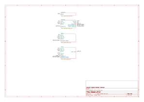
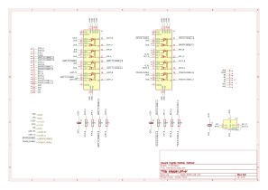
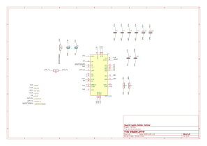
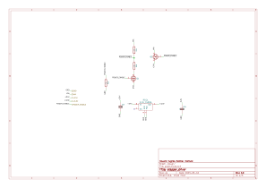
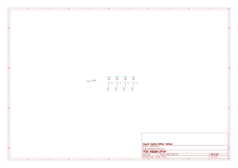

- [About](#org794a03e)
- [Images](#org3e196b1)
- [Schematic](#org0c2e356)
- [PCB](#orgc5b85b8)
- [Bill of Materials](#org93fe066)
- [Development](#org0b31915)

    <!-- This file is generated automatically from metadata -->
    <!-- File edits may be overwritten! -->


<a id="org794a03e"></a>

# About

```markdown
- Project Name: stepper_driver
- Description: Motor mounted stepper driver with step and direction controls and a UART interface.
- Version: 2.0
- Kicad Version: 7.0.8
- Release Date: 2023-10-12
- Creation Date: 2021-09-30
- License: BSD-3-Clause
- URL: https://github.com/janelia-kicad/stepper_driver
- Author: Peter Polidoro
- Email: peter@polidoro.io
- Copyright: 2023 Howard Hughes Medical Institute
- References:
  - https://www.kicad.org/
  - https://www.trinamic.com/products/integrated-circuits/details/tmc2209-la/
```


<a id="org3e196b1"></a>

# Images


<a id="org0c2e356"></a>

# Schematic

[./documentation/schematic/stepper\_driver-tmc2209.pdf](./documentation/schematic/stepper_driver-tmc2209.pdf)

[./documentation/schematic/stepper\_driver.pdf](./documentation/schematic/stepper_driver.pdf)












<a id="orgc5b85b8"></a>

# PCB


<a id="org93fe066"></a>

# Bill of Materials


## Board

|    |
|--- |
|  |


## Supplemental

| Item | Description | Manufacturer Part Number | Manufacturer | Quantity |
|---- |----------- |------------------------ |------------ |-------- |


<a id="org0b31915"></a>

# Development


## Install Guix

[Install Guix](https://guix.gnu.org/manual/en/html_node/Binary-Installation.html)


## Edit metadata.org

    make -f .metadata/Makefile metadata-edits


## Tangle metadata.org

    make -f .metadata/Makefile metadata


## Edit project

    make -f .metadata/Makefile kicad-edits
    exit